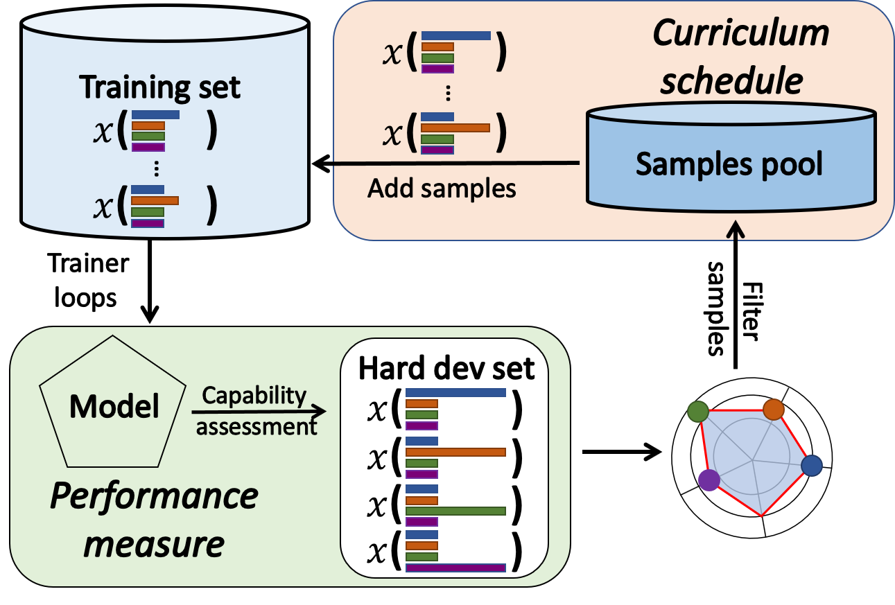
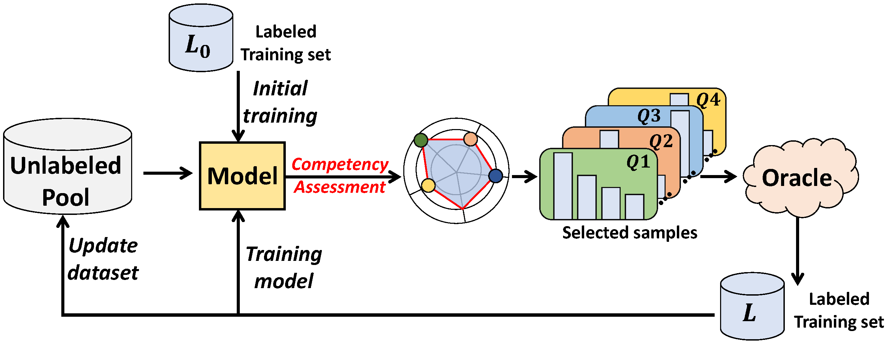

# Feeding What You Need by Understanding What You Learned
This repository is the official implementation of [the paper](https://arxiv.org/abs/2203.02753).

<div style="text-align: center;">
    
    <p><big><strong>and</strong></big></p>
    
</div>

## Abstract
Machine Reading Comprehension (MRC) reveals the ability to understand a given text passage and answer questions based on it. Existing research works in MRC rely heavily on large-size models and corpus to improve the performance evaluated by metrics such as Exact Match (EM) and F1. However, such a paradigm lacks sufficient interpretation to model capability and can not efficiently train a model with a large corpus. In this paper, we argue that a deep understanding of model capabilities and data properties can help us feed a model with appropriate training data based on its learning status. Specifically, we design an MRC capability assessment framework that assesses model capabilities in an explainable and multi-dimensional manner. Based on it, we further uncover and disentangle the connections between various data properties and model performance. Finally, to verify the effectiveness of the proposed MRC capability assessment framework, we incorporate it into a curriculum learning pipeline and devise a Capability Boundary Breakthrough Curriculum (CBBC) strategy, which performs a model capability-based training to maximize the data value and improve training efficiency.Extensive experiments demonstrate that our approach significantly improves performance, achieving up to an 11.22% / 8.71% improvement of EM / F1 on MRC tasks.

## Usage
- See `/competency_metrics/` directory for evaluating a sample.
- See `/cbbc/` directory for assessing a model's competency from 4-dimensional capability.

## Acknowledge
- thanks to the co-authors for their constructive suggestions.
- codebase is inspired by the [Mean Teacher Framework](https://github.com/CuriousAI/mean-teacher).

## License
Copyright 2022 Author of this paper

Permission is hereby granted, free of charge, to any person obtaining a copy of this software and associated documentation files (the "Software"), to deal in the Software without restriction, including without limitation the rights to use, copy, modify, merge, publish, distribute, sublicense, and/or sell copies of the Software, and to permit persons to whom the Software is furnished to do so, subject to the following conditions:

The above copyright notice and this permission notice shall be included in all copies or substantial portions of the Software.

THE SOFTWARE IS PROVIDED "AS IS", WITHOUT WARRANTY OF ANY KIND, EXPRESS OR IMPLIED, INCLUDING BUT NOT LIMITED TO THE WARRANTIES OF MERCHANTABILITY, FITNESS FOR A PARTICULAR PURPOSE AND NONINFRINGEMENT. IN NO EVENT SHALL THE AUTHORS OR COPYRIGHT HOLDERS BE LIABLE FOR ANY CLAIM, DAMAGES OR OTHER LIABILITY, WHETHER IN AN ACTION OF CONTRACT, TORT OR OTHERWISE, ARISING FROM, OUT OF OR IN CONNECTION WITH THE SOFTWARE OR THE USE OR OTHER DEALINGS IN THE SOFTWARE.

## Citation
```latex
@article{wang2022feeding,
  title={Feeding What You Need by Understanding What You Learned},
  author={Wang, Xiaoqiang and Liu, Bang and Xu, Fangli and Long, Bo and Tang, Siliang and Wu, Lingfei},
  journal={arXiv preprint arXiv:2203.02753},
  year={2022}
}
```