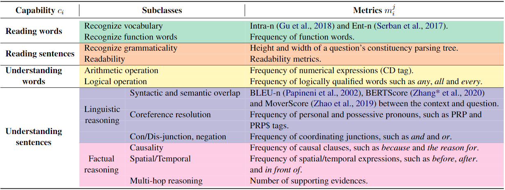

# Evaluation Metrics for Our Competency Assessment Framework



## Prepare for the data

- Download the following datasets
    - [SQuAD1.1](https://rajpurkar.github.io/SQuAD-explorer/)
    - [SQuAD2.0](https://rajpurkar.github.io/SQuAD-explorer/)
    - [HotpotQA](https://hotpotqa.github.io/)
    - [RACE](https://www.cs.cmu.edu/~glai1/data/race/)

- Convert the samples from different datasets into a unified format, for example,
    - SQuAD1.1 and SQuAD2.0
    ```json
        {
            "question_id": {
                "question": "",
                "answer": [ "" ],
                "context": ""
            }
            // ...
            // more samples
        }
    ```
    - HotpotQA
    ```json
        {
            "question_id": {
                "question": "",
                "answer": "",
                "context": "",
                "supporting_facts": [ 
                    [ "", 0 ]
                    // ...
                    // more supporting_facts
                ],
                "type": "",
                "level": ""
            }
            // ...
            // more samples
        }
    ```
    - RACE
    ```json
        {
            "split-level-paragraph_id-question_id": {
                "question": "",
                "context": "",
                "options": {
                    "A": "",
                    "B": "",
                    "C": "",
                    "D": ""
                },
                "answer": ""
            }
            // ...
            // more samples
        }
    ```
    - We provide the script `convert_dataset.py` for converting different datasets in the corresponding dataset split subdir, that is,
        - `squad1_dev` and `squad1_training`
        - `squad2_dev` and `squad2_training`
        - `hotpotqa_dev` and `hotpotqa_training`
        - `race_dev` and `race_training`
- Save the files with the unified format into corresponding dataset split subdir as `dump.json` (or your specified target filename in the script).

## Prepare for the scripts
- In addtion to our provided scripts, some metrics may require addtional static embeddings or checkpoints, that is
    - GloVe Embedding in `Evaluator.py`
        - Download raw vector file (i.e., glove.6B.300d.txt in plain text format) from [here](https://github.com/stanfordnlp/GloVe).
        - Convert it into binary format using our `glove2word2vec.py`.
        - Save the generated file `glove.6B.300d.model.bin` into the same directory as the `embedding.py` (default in the directory `/competency_metrics/`).
    - Stanford CoreNLP Parser in `tree.py`
        - Download the CoreNLP Java release package from [here](https://nlp.stanford.edu/software/stanford-corenlp-latest.zip).
        - Startup CoreNLP server with the following command:
        ```bash
            java -mx4g -cp "*" edu.stanford.nlp.pipeline.StanfordCoreNLPServer -port 9000 -timeout 150000 -props StanfordCoreNLP.properties
        ```
    - MoverScore checkpoint in `moverscore.py`
        - The MoverScore implementation will download the checkpoint from Huggingface Hub.
        - However, before running the `moverscore.py`, you should configure the checkpoint directory by modifying the environment variable `os.environ['MOVERSCORE']` in the `moverscore.py` as you wish.

    - BLEURT pre-trained checkpoint in `bleurt.py`
        - Download the pre-trained BLEURT-base checkpoint from [here](https://storage.googleapis.com/bleurt-oss-21/BLEURT-20.zip).
        - Unzip and save it into the same directory as the `bleurt.py` (default in the directory `/competency_metrics/`).

- Run the script `run_all.sh` for every subdir by specifying the shell variable `DUMP` in the `run_all.sh`.

## Generate the 4-dimensional capability-specific value map for a sample
```bash
# first
python difficulty_generator.py /path/to/evaluation_dataset_root
# then
python difficulty_merger.py /path/to/evaluation_dataset_root
```